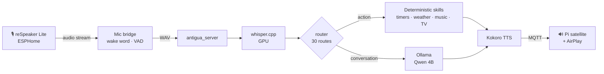

<div align="center">

# Antigua

**A self-hosted voice assistant for the whole house.**<br>
Local speech, local LLM, local voice — and deterministic code for everything that acts.

[](https://github.com/flavanoids/antigua-assistant/actions/workflows/ci.yml)
[](LICENSE)


[Features](#features) · [How it works](#how-it-works) · [Quickstart](#quickstart) · [Stack](#stack) · [Docs](#docs)

</div>

---

## Features

| | |
|---|---|
| 🎙️ **Hands-free** | Wake word on a Wi-Fi mic, push-to-talk button, LED feedback, 8 s follow-ups |
| ⏱️ **Timers & alarms** | Named, recurring ("every weekday at 7"), snooze, reminders, "which one?" |
| 🌦️ **Weather** | Anywhere, rain timing, "do I need a jacket?", severe alerts announced unprompted |
| 🎵 **Music** | Apple Music on any AirPlay speaker — artist, album, lyrics, year; ducks while you talk |
| 📺 **TV & lights** | Apple TV + Roku (power, apps, inputs), Govee lights and scenes |
| 🧮 **Quick answers** | Calculator, units, currency, sports scores, news briefings, live web search |
| 📝 **Household memory** | Shopping lists, "remember I took my medicine", per-person recall |
| 🌎 **Bilingual** | Speak Spanish, get Spanish back |
| 🛟 **Failover** | A backup box takes over the whole pipeline if the primary goes down |

Full phrase list: [SKILLS.md](SKILLS.md).

### Why it's different

- **The LLM never acts.** 30 routes are parsed by regex and executed in code; the model only talks. A 4B model can't turn off your TV by misreading a sentence.
- **Grounded answers.** Sentences that assert names, numbers or weather absent from the provided context are dropped before speaking.
- **Private by default.** Audio and transcripts never leave the house and are deleted after 7 days. Only live-data skills (weather, news, sports, currency, search, music) go online.

## How it works



## Quickstart

```bash
git clone https://github.com/flavanoids/antigua-assistant antigua && cd antigua
git config core.hooksPath .githooks
cp server/config/server.example.yaml server/config/server.yaml          # household, location, devices
cp server/config/system_prompt.example.txt server/config/system_prompt.txt
python3 -m venv venv && venv/bin/pip install -r server/requirements.txt -r server/requirements-tts.txt
```

Then follow [docs/deployment.md](docs/deployment.md) for each machine. Missing config falls back to the `.example` files, so a fresh clone boots.

> [!NOTE]
> Antigua runs in one real house and assumes some of its hardware (AMD GPU, HiFiBerry DAC, Apple TV). Expect to adapt.

---

## Stack

| Layer | Tech |
|---|---|
| Wake word · VAD | openWakeWord (`alexa`, 0.75), Silero VAD |
| STT | whisper.cpp large-v3-turbo on Vulkan (~0.3 s); faster-whisper CPU fallback |
| LLM | Ollama, Qwen 4B, `num_ctx` 8192, pinned in VRAM, cache-friendly prompt |
| TTS | Kokoro-82M ONNX, fixed three-voice blend, content-hash cache |
| Mic | Seeed reSpeaker Lite (ESP32-S3 + XMOS AEC) on ESPHome, via `aioesphomeapi` |
| Transport | MQTT (Mosquitto) for playback and alarms, HTTP for turns |
| Integrations | MCP servers (Apple TV, Roku, Govee), Music Assistant, SearXNG |
| Network | WireGuard mesh + nftables port guard |

## Hardware

| Role | Runs |
|---|---|
| **Primary** — Linux + GPU (8 GB VRAM) | STT, LLM, TTS, pipeline, mic bridge, SearXNG, Music Assistant |
| **Satellite** — Raspberry Pi 4 + DAC | Mosquitto, reply/alarm playback, AirPlay |
| **Backup** — any small box (optional) | Backup TTS; full fallback pipeline + standby mic bridge |
| **Mic** — reSpeaker Lite | Continuous audio stream, LED, button |

## Layout

```text
server/antigua_server.py        primary server: backends, HTTP, MQTT
server/antigua_fallback_server.py
server/antigua_core/            shared pipeline, routing, skills, settings
server/antigua_core/intents/    one parser module per skill
antigua_satellite.py            Pi: playback, alarms, ducking, failover watch
kitchen-mic/                    ESPHome config + mic bridge
network/                        WireGuard mesh + port guard
tests/                          network-free suites (pytest or plain scripts)
```

## Development

```bash
ruff check .
pytest              # each suite runs in its own process; no network, GPU or config needed
```

Real config is git-ignored; `*.example.*` files are the templates. The pre-commit hook blocks recordings, logs, and anything matching your own `.githooks/private-patterns`. See [CONTRIBUTING.md](CONTRIBUTING.md).

## Docs

[Architecture](docs/architecture.md) · [Deployment](docs/deployment.md) · [Design decisions](docs/decisions.md) · [Skills](ANTIGUA_SKILLS/README.md) · [Kitchen mic](kitchen-mic/README.md) · [Network](network/README.md) · [MCP](server/mcp/README.md) · [Changelog](CHANGELOG.md)

## License

[MIT](LICENSE)
